<p align="center">
  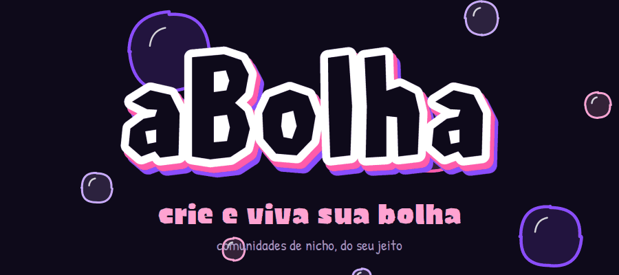
</p>

<p align="center">
  
  
  
  
  
</p>

<p align="center">
  <b>Uma rede social de comunidades por afinidade.</b><br>
  Entre na sua bolha, poste, comente, converse e siga gente que curte o mesmo que você.
</p>

<p align="center">
  <a href="#baixar"><b>⬇️ Baixar o app</b></a> &nbsp;•&nbsp;
  <a href="#telas"><b>📱 Ver as telas</b></a> &nbsp;•&nbsp;
  <a href="#docs"><b>📚 Documentação</b></a>
</p>

<br>

<p align="center">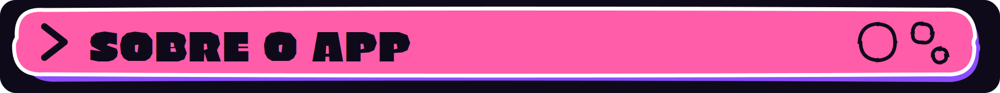</p>

**aBolha** é um aplicativo mobile que conecta pessoas em comunidades de interesses específicos: jogos, animes, séries, esportes, hobbies, música e o que mais couber numa "bolha". É parecido com o antigo Amino, mas com ambições maiores: entrada mais leve, visual autoral e foco no público brasileiro.

Hoje quem quer entrar numa comunidade esbarra em dois extremos: o **Discord**, que exige já conhecer o servidor certo, e o **Reddit/fóruns**, pesados em texto e pouco convidativos para quem está começando. O aBolha resolve isso com **descoberta de comunidades por afinidade**: cada comunidade é uma *bolha* com feed, comentários, curtidas e conversa próprios.

<p align="center">
  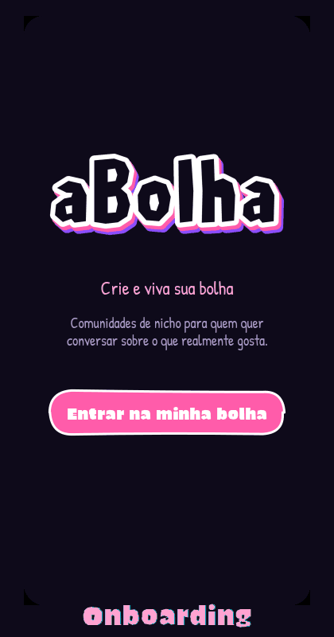
  <br><sub>Um passeio pelo app: do onboarding ao perfil.</sub>
</p>

<br>

<p align="center">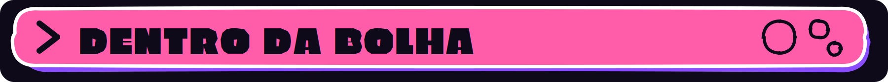</p>

### 🫧 Bolhas: crie, entre, saia

Qualquer pessoa pode **criar uma bolha** com nome, descrição e foto, e **entrar ou sair** das comunidades que quiser. A aba *Bolhas* separa **Minhas Bolhas** de **Todas**, e cada bolha tem a própria página com os posts da comunidade.

<table>
<tr>
<td width="55%" valign="top">

### 📰 Feed que não acaba

Na **Home** aparecem os posts mais recentes das bolhas, em **rolagem infinita**: o app carrega de 5 em 5 conforme você desce. Cada post mostra autor, a bolha de origem, curtidas e número de comentários.

Dá para **curtir**, **comentar**, **responder comentários** (com respostas aninhadas) e **excluir** os seus próprios posts e comentários. Tudo atualiza em tempo real.

</td>
<td width="45%" align="center">
  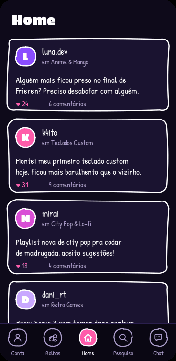
</td>
</tr>
<tr>
<td width="45%" align="center">
  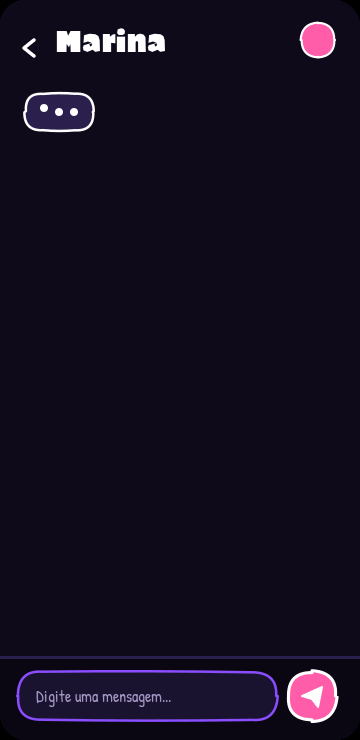
</td>
<td width="55%" valign="top">

### 💬 Conversa em tempo real

Além dos comentários, cada pessoa pode **trocar mensagens privadas 1 a 1**. A aba *Chat* lista as suas conversas, e as mensagens chegam na hora, sem precisar atualizar nada.

</td>
</tr>
</table>

### 👤 Perfil, seguidores e conta

Cada pessoa tem um **perfil** com os seus posts, contagem de **seguidores** e **seguindo**, e pode **seguir** ou deixar de seguir outras. Dá para **editar os dados do perfil**, **trocar a senha** e **sair da conta**. O login é por e-mail e senha, e a **sessão fica salva no aparelho**: você abre o app e já cai direto na Home, sem passar pelo login de novo.

<br>

<a id="telas"></a>
<p align="center">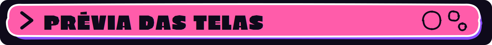</p>

<p align="center">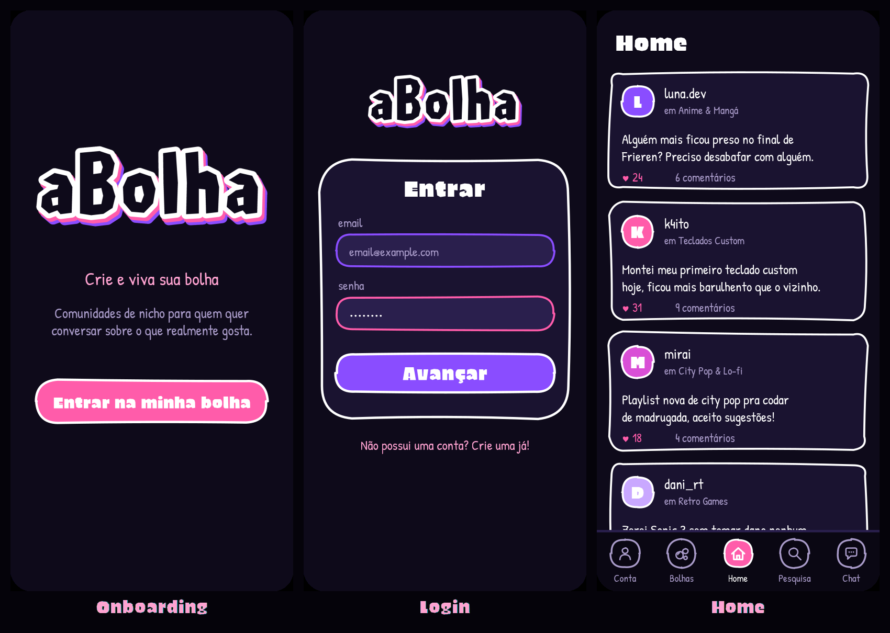</p>
<p align="center">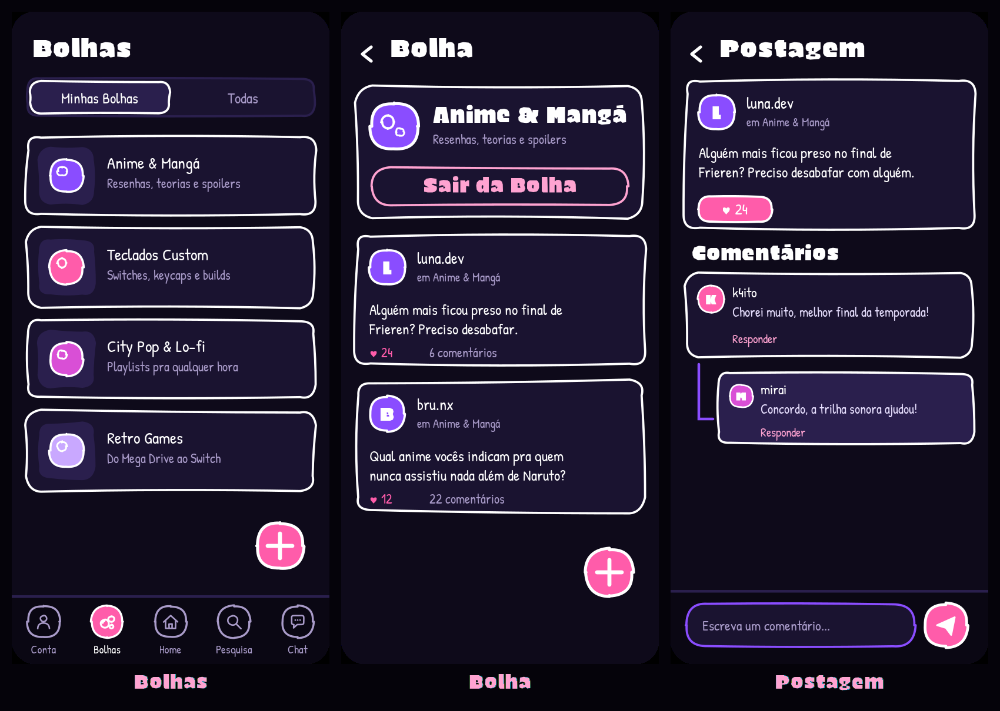</p>
<p align="center">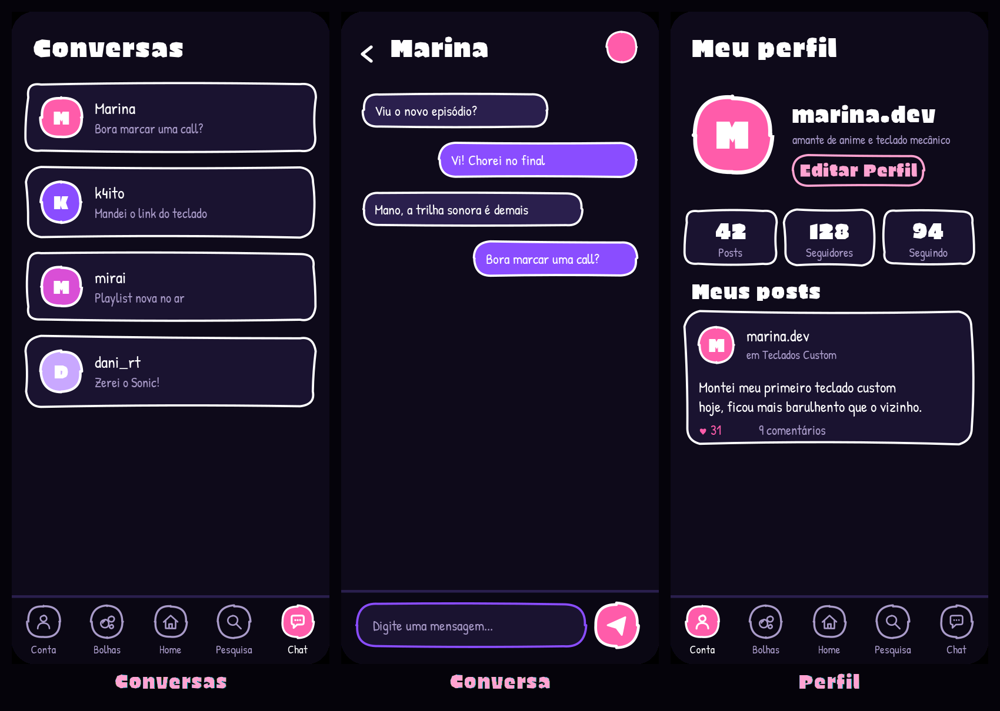</p>

<p align="center"><sub><i>Prévias ilustrativas do design do app, desenhadas com a mesma paleta, fontes e bordas do projeto. Para trocar por capturas reais, substitua os arquivos de <code>assets/readme/telas/</code>.</i></sub></p>

<br>

<a id="baixar"></a>
<p align="center">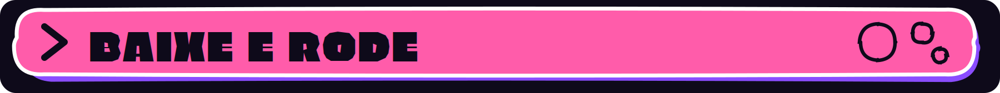</p>

### Opção 1 — Baixar o APK (Android)

1. Abra a página de **[Releases](https://github.com/enzinh16/aBolha/releases)**.
2. Baixe o arquivo `aBolha.apk` da versão mais recente.
3. No celular, permita a instalação de apps de fontes desconhecidas e abra o arquivo.

> ℹ️ O APK só aparece em *Releases* depois que alguém do grupo publicar a versão. Enquanto isso, use a opção 2.

### Opção 2 — Rodar a partir do código

**O que você precisa**

| Ferramenta | Para quê |
|---|---|
| [Flutter SDK](https://docs.flutter.dev/get-started/install) | compatível com Dart `^3.13.3` (veja o `pubspec.yaml`) |
| Android Studio ou VS Code | editor e emulador Android |
| Um celular Android ou emulador | para abrir o app |

**Passo a passo**

```bash
# 1. Baixe o projeto
git clone https://github.com/enzinh16/aBolha.git
cd aBolha/app

# 2. Instale as dependências
flutter pub get

# 3. Confira se está tudo certo no ambiente
flutter doctor

# 4. Rode no celular/emulador conectado
flutter run
```

**Gerar o seu próprio APK**

```bash
flutter build apk --release
# arquivo gerado em: app/build/app/outputs/flutter-apk/app-release.apk
```

> 🔥 **Firebase:** o projeto já vem configurado para o Firebase do grupo (`lib/firebase_options.dart` e `android/app/google-services.json`), então login, posts e chat funcionam sem configurar nada. Para usar o **seu** Firebase, rode `flutterfire configure` dentro de `app/` e ative **Authentication (e-mail/senha)** e **Cloud Firestore** no console.

<br>

<p align="center">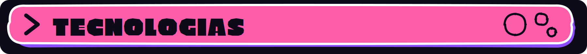</p>

| Camada | Tecnologia |
|---|---|
| App | **Flutter** (Dart), Material 3 com tema escuro próprio |
| Login | **Firebase Authentication** (e-mail e senha, sessão persistente) |
| Dados em tempo real | **Cloud Firestore** (bolhas, posts, curtidas, comentários, conversas, seguidores) |
| Visual | Componentes desenhados à mão: `SketchBorder`, `SketchInputBorder`, `SketchAvatar` |
| Fontes | **Bolha Display** (derivada da Erica One) e **Patrick Hand**, ambas OFL |
| Plataforma alvo | Android (principal) e iOS |

<br>

<p align="center">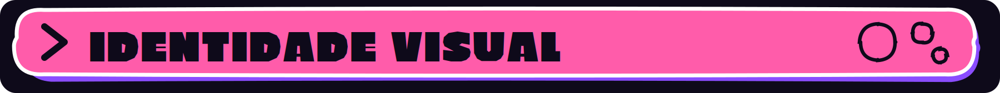</p>

O aBolha foi redesenhado para falar com quem vive na internet: **tema escuro**, **roxo e rosa** (nada de azul parecido com rede social) e um traço de **adesivo desenhado à mão**, com contorno branco grosso e formas levemente tortas.

<p align="center"></p>
<p align="center"></p>
<p align="center">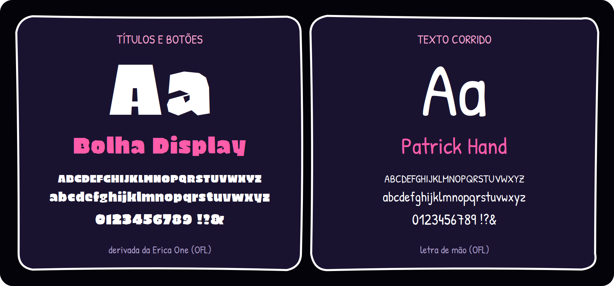</p>
<p align="center"></p>

Detalhes completos em [`docs/iden-visual.md`](docs/iden-visual.md).

<br>

<p align="center">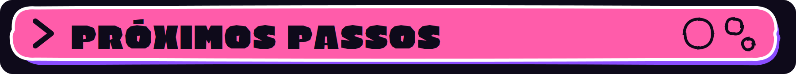</p>

**Já está no app**

- [x] Cadastro, login e sessão salva no aparelho
- [x] Criar, entrar e sair de bolhas
- [x] Feed com rolagem infinita, posts, curtidas e comentários com respostas
- [x] Chat privado 1 a 1 em tempo real
- [x] Seguir, seguidores e seguindo
- [x] Edição de perfil, troca de senha e logout
- [x] Identidade visual v2 (escura, roxo e rosa, desenhada à mão)

**Vem aí**

- [ ] Tela de **Pesquisa** (hoje a aba é um espaço reservado)
- [ ] **Onboarding por interesses**, com sugestão de bolhas
- [ ] **Imagens nos posts** (o modelo já tem o campo, falta a tela de envio)
- [ ] **Chat em grupo** por bolha
- [ ] **Gamificação leve**: níveis e badges por participação
- [ ] **Moderação** híbrida (IA em casos menores e equipe nos críticos)
- [ ] Monetização freemium (bolhas premium, moedas virtuais, anúncios por nicho)
- [ ] Publicar o APK em *Releases*

<br>

<p align="center">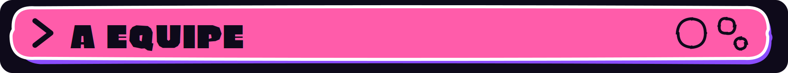</p>

| Nome | RM |
|------|----|
| Auro Vanetti | RM563761 |
| Renan Mano Otero | RM554911 |
| Marco Antonio Ferreira Fonseca | RM566434 |
| Bruno Soares de Santanna | RM562235 |
| Enzo Yokokura Araujo | RM564177 |

Projeto da disciplina **Application Development**, FIAP.

<br>

<a id="docs"></a>
<p align="center">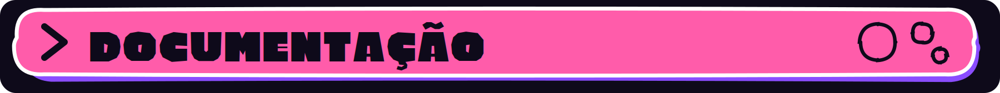</p>

| Documento | O que tem |
|---|---|
| 📄 [Documentação inicial](docs/doc-init.md) | problema, público-alvo, funcionalidades entregues, arquitetura e fora do escopo |
| 🎨 [Marca e identidade visual](docs/iden-visual.md) | naming, tom de voz, paleta, tipografia, logo e bordas |
| 💡 [Pitch](docs/pitch.md) | por que existe, modelo de negócio e diferencial competitivo |
| 🧩 [Figma (versão v1 do CP4)](https://www.figma.com/design/38aT0QTtkFo71ZaKE8XGIb/CP4?node-id=7-2&t=r9vnsEHf1n3dl786-1) | protótipo da primeira identidade, em azul |

<br>

<p align="center">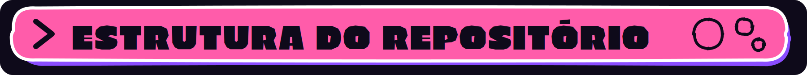</p>

```
aBolha/
├── app/                      # projeto Flutter
│   ├── android/ ios/ ...     # pastas de cada plataforma
│   ├── assets/
│   │   ├── fonts/            # Bolha Display e Patrick Hand (+ licença OFL)
│   │   └── images/           # logo e wordmark usados no app
│   ├── lib/
│   │   ├── models/           # bolha, post e comentário
│   │   ├── services/         # auth, bolhas, posts, chat, seguidores
│   │   ├── screens/          # telas do app
│   │   ├── theme/            # paleta e bordas desenhadas à mão
│   │   └── widgets/          # barra inferior, cards e botões
│   └── pubspec.yaml
├── assets/
│   ├── images/               # logo, wordmark, paleta, tipografia e bordas
│   └── readme/               # banners, GIFs e prévias deste README
├── docs/
│   ├── doc-init.md
│   ├── iden-visual.md
│   ├── pitch.md
│   └── arte/                 # SVGs do logo e do wordmark
└── README.md
```

<br>

<p align="center">
  <br>
  <sub>Feito com roxo, rosa e muita bolha. · FIAP · Equipe 11</sub>
</p>
