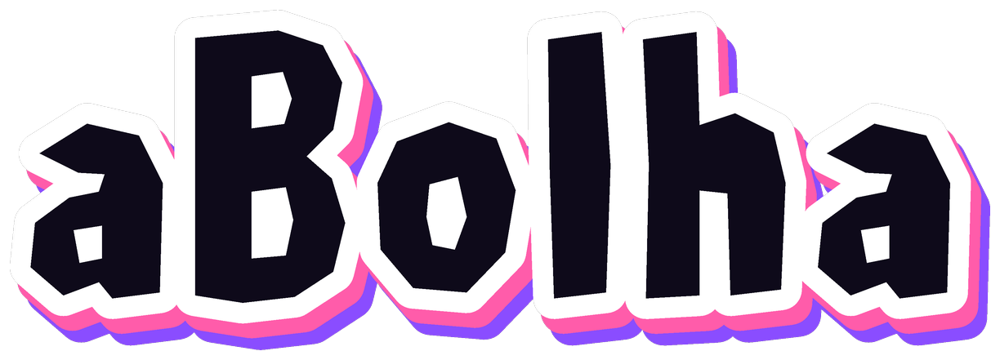
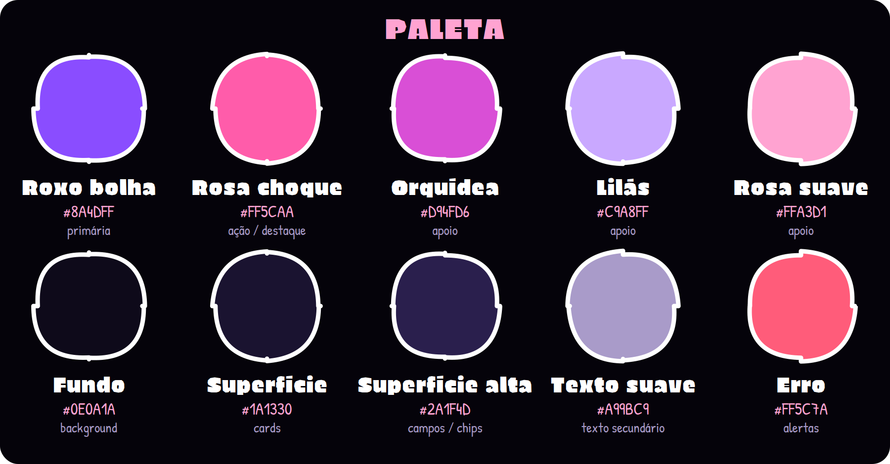
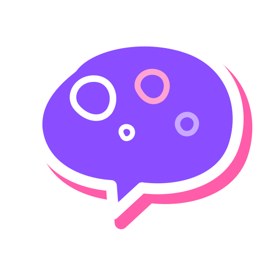
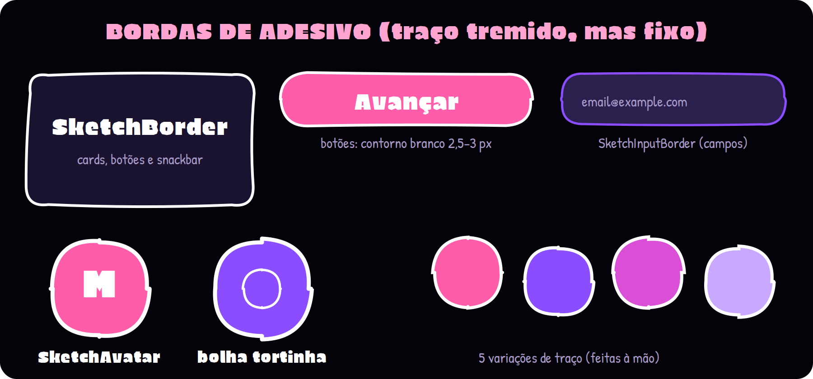

# Marca e Identidade Visual — aBolha 🫧

> **Versão 2.** A primeira identidade (CP4) era azul e translúcida; ela foi substituída por uma versão **escura, em roxo e rosa e desenhada à mão**. O histórico e os motivos estão na seção 7.

  

## 1. Nome: aBolha

### Naming rationale

"aBolha" foi escolhido por três motivos:

1. **Metáfora direta do produto**: cada comunidade de nicho é uma "bolha": um espaço fechado e protegido onde pessoas com o mesmo interesse se encontram. É o mesmo fenômeno que os algoritmos de rede social criam sem querer (a "bolha do algoritmo"), só que aqui é intencional e positivo: você escolhe em qual bolha entrar.
2. **Curto, fácil de falar e de lembrar**: artigo + uma palavra, comum no vocabulário do dia a dia em português, com maneiras de se fracionar de acordo com o nome da comunidade/bolha (como "aBolha da Rockstar") sem necessidade de explicação.
3. **Visualmente rico**: "bolha" já sugere formas redondas e coloridas, uma identidade natural para o logo e para os elementos de interface (balões de chat, avatares, tags).

O slogan que acompanha o nome, **"Crie e viva sua bolha"**, reforça a proposta de valor central: pertencimento. É a frase que aparece na tela de onboarding do app.

## 2. Tom de voz

- **Próximo e informal**: o app fala como um amigo, não como uma empresa. Uso de linguagem coloquial brasileira, sem gírias forçadas.
- **Acolhedor**: mensagens de erro, onboarding e notificações são escritas para incluir, nunca para constranger (ex.: em vez de "Erro: campo inválido", usa-se algo como "Ops, faltou preencher isso aqui").
- **Curioso e leve**: o app estimula exploração ("Vamos descobrir sua próxima bolha?") em vez de comandos diretos.
- **Nunca corporativo**: evitar jargão de "plataforma", "engajamento", "ecossistema" na comunicação voltada ao usuário final.

## 3. Princípios visuais

1. **Escuro primeiro**: o app tem apenas o tema escuro (`AppTheme.dark`).
2. **Contorno de adesivo**: tudo que importa tem contorno branco grosso (2,5 a 4,5 px).
3. **Traço tremido, mas fixo**: as formas têm pequenos desvios escolhidos à mão, como se tivessem sido traçadas com o mouse. Não são sorteados, então o desenho é sempre o mesmo a cada abertura do app.
4. **Cores chapadas**: sem degradê e sem sombra suave. Sem azul e sem verde.

## 4. Paleta de cores

| Papel | Cor | Hex |
|---|---|---|
| Marca (botões, destaques) | Roxo bolha | `#8A4DFF` |
| Ação principal e destaque | Rosa choque | `#FF5CAA` |
| Apoio | Orquídea · Lilás · Rosa suave | `#D94FD6` · `#C9A8FF` · `#FFA3D1` |
| Fundo | Roxo quase preto | `#0E0A1A` |
| Superfície · Superfície alta | cards · campos e chips | `#1A1330` · `#2A1F4D` |
| Barra inferior | Roxo-noite | `#0A0713` |
| Texto · Texto secundário | Branco · Lilás-cinza | `#FFFFFF` · `#A99BC9` |
| Erro | Rosa-vermelho | `#FF5C7A` |

Contrastes medidos: branco sobre `#8A4DFF` = 4,6:1; rosa `#FF5CAA` sobre `#0E0A1A` = 6,8:1; texto secundário sobre `#0E0A1A` = 7,6:1. As cores ficam todas em `BolhaColors`, em `app/lib/theme/app_theme.dart`.

  

## 5. Tipografia

- **Títulos e botões**: **Bolha Display**, uma fonte pesada de contornos facetados, derivada da *Erica One* (licença OFL) para combinar com as letras do wordmark.
- **Texto corrido**: **Patrick Hand**, uma letra de mão legível em telas pequenas (licença OFL).

As licenças estão em `app/assets/fonts/`.

  

## 6. Logo e componentes

### Wordmark e ícone

O wordmark **aBolha** é feito de letras grossas e angulosas, desenhadas à mão ponto a ponto, com **contorno branco de adesivo** e uma **sombra deslocada em rosa e roxo**. O ícone é um balão de chat roxo com bolhas de sabão desenhadas dentro: o balão diz que é social, as bolhas dizem que é o aBolha. Os arquivos editáveis estão em `docs/arte/`.

  

### Bordas de adesivo (código)

O estilo desenhado à mão vira três componentes em `app/lib/theme/sketch_shapes.dart`, que substituem os widgets padrão do Flutter:

| Componente | Substitui | Usado em |
|---|---|---|
| `SketchBorder` | `RoundedRectangleBorder` | cards, botões, snackbar |
| `SketchInputBorder` | `OutlineInputBorder` | campos de texto |
| `SketchAvatar` | `CircleAvatar` | avatares e ícones da barra inferior |

O botão redondo rosa de criar bolha e de enviar mensagem é o `SketchCircleButton` (`app/lib/widgets/sketch_circle_button.dart`).

  

## 7. Histórico: de azul para roxo e rosa

| | v1 (CP4) | **v2 (atual)** |
|---|---|---|
| Tema | claro, com modo escuro previsto | **escuro** |
| Cor principal | azul `#2196F3` | **roxo `#8A4DFF` + rosa `#FF5CAA`** |
| Estilo | balão azul com degradê e brilho | **adesivo desenhado à mão, cores chapadas** |
| Fontes | Poppins Extra Bold e Inter Extra Bold | **Bolha Display e Patrick Hand** |
| Logo | balão de chat azul translúcido | **wordmark aBolha + balão roxo com bolhas** |

**Por que mudamos:** o azul lembrava demais o Twitter/X, e o público do app é muito ligado na internet, então precisávamos de algo com mais personalidade. O visual de adesivo desenhado à mão dá identidade própria e funciona bem no escuro.

O protótipo da identidade v1 continua no Figma: 🔗 [Figma do CP4](https://www.figma.com/design/38aT0QTtkFo71ZaKE8XGIb/CP4?node-id=7-2&t=r9vnsEHf1n3dl786-1)

## 8. Prévia das telas

  

*Prévias ilustrativas do design do app, feitas com a mesma paleta, fontes e bordas do projeto.*
